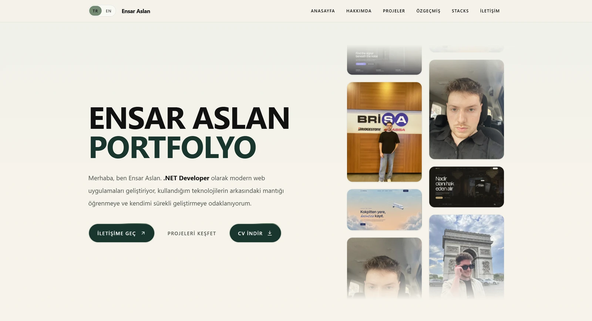
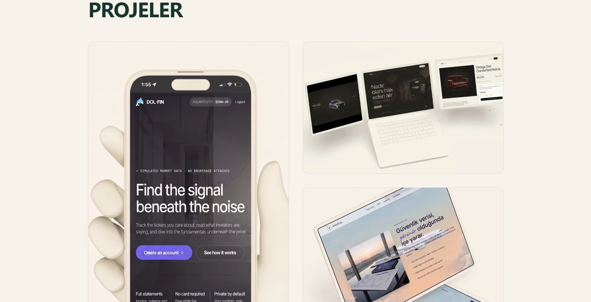
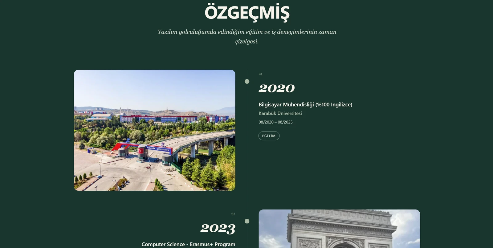

# Profile

🇹🇷 [Türkçe](README.md) | 🇬🇧 [English](README.en.md)

Ensar Aslan's personal portfolio site. It presents the About, Projects, Resume, Stacks and Contact sections on a single page.

**Live:** https://ensaraslan.vercel.app

## Tech Stack

| Area | Technology |
| --- | --- |
| UI | React 19, TypeScript |
| Build tool | Vite |
| Styling | Tailwind CSS |
| Routing | React Router |
| Testing | Vitest |
| Deployment | Vercel |
